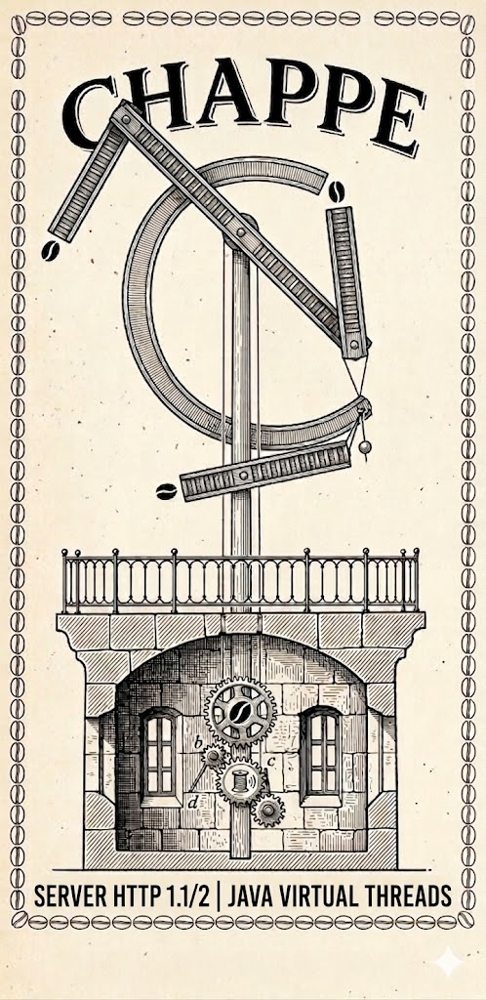

<p align="center">
  
</p>

<h1 align="center">Chappe</h1>

<p align="center">
  <strong>High-performance HTTP server in pure Java 25 — zero dependencies, virtual threads</strong>
</p>

<p align="center">
  <a href="https://www.java.com/"></a>
  <a href="https://maven.apache.org/"></a>
  <a href="LICENSE"></a>
  
  
</p>

---

> **Claude Chappe** (1763–1805) invented the semaphore telegraph — a network of optical towers
> that covered all of France. This project is its digital heir.

## Overview

**Chappe** is an HTTP server written in **pure Java 25**, with no external dependencies.
It is designed as the transport layer of the **Vidocq** ecosystem — Servlet and
JAX-RS extensions mount on top of it via a dedicated SPI, without coupling.

## Quick Start

```java
import io.vidocq.chappe.api.*;
import java.nio.charset.StandardCharsets;

void main() {
    var router = Router.builder()
        .get("/", _ -> Response.ok("Hello, Chappe!"))
        .get("/users/{id}", req -> {
            var id = req.pathParams().get("id");
            return Response.ok("User " + id);
        })
        .post("/users", req -> {
            var body = new String(req.body().asInputStream().readAllBytes(), StandardCharsets.UTF_8);
            return Response.builder()
                .status(StatusCode.CREATED)
                .header("Content-Type", "application/json")
                .body("{\"received\": " + body + "}")
                .build();
        })
        .put("/users/{id}", req -> {
            var body = new String(req.body().asInputStream().readAllBytes(), StandardCharsets.UTF_8);
            return Response.ok("Updated " + req.pathParams().get("id") + ": " + body);
        })
        .delete("/users/{id}", req -> Response.of(StatusCode.NO_CONTENT))
        .build();

    try (var server = Server.builder()
            .port(8080)
            .handler(router)
            .build()) {
        server.start();
        Thread.currentThread().join();
    }
}
```

## Features

### Protocols
- **HTTP/1.1** — RFC 9110/9112 (keep-alive, chunked, pipelining)
- **HTTP/2** — RFC 9113 (multiplexing, HPACK, flow control, CONTINUATION)
- **HTTPS** — TLS via SSLContext/SSLEngine, ALPN (h2 + http/1.1)
- **WebSocket** — RFC 6455 over HTTP/1.1 (handshake `Sec-WebSocket-Accept`, TEXT/BINARY framing, fragmentation, UTF-8 validation, mandatory client masking, close handshake, auto-PONG)
- **gRPC (transport)** — core framing (5-byte prefix) over HTTP/2 + trailers; 4 modes (unary, server-stream, client-stream, bidi); byte-level `GrpcCall` SPI — serialization (protobuf, JSON…) delegated to the application or to a dedicated extension (`champollion`)

### Routing
```java
Router.builder()
    .get("/api/users", handler)          // GET
    .post("/api/users", handler)         // POST
    .put("/api/users/{id}", handler)     // PUT with path param
    .delete("/api/users/{id}", handler)  // DELETE
    .patch("/api/users/{id}", handler)   // PATCH
    .head("/api/health", handler)        // HEAD (also automatic for GET)
    .options("/api/users", handler)      // OPTIONS
    .get("/static/*", handler)           // wildcard
    .group("/v1", api -> api             // group with prefix
        .filter(authFilter)              // scope-level filter
        .get("/data", handler)
    )
    .mount("/admin", adminApp)           // mount a sub-app (path stripping)
    .notFound(custom404)                 // custom 404
    .build()
```

- **Automatic 405**: if the path matches but not the method → `405 Method Not Allowed` with `Allow` header
- **Auto HEAD**: a GET route also responds to HEAD (body removed automatically)
- **Trailing slash**: `/users` and `/users/` match the same route
- **Percent-decoding**: `/users/John%20Doe` → pathParam = `"John Doe"`

### Request & Response
```java
// Read the body of a POST/PUT request
.post("/api/data", req -> {
    byte[] raw = req.body().asInputStream().readAllBytes();
    String text = new String(raw, StandardCharsets.UTF_8);
    // req.method(), req.path(), req.headers(), req.queryParams()
    // req.pathParams(), req.header("Content-Type"), req.body()
    return Response.ok(text);
})

// Build a response with the builder
.get("/api/user", _ -> Response.builder()
    .status(StatusCode.OK)
    .header("Content-Type", "application/json")
    .header("X-Custom", "value")
    .body("{\"name\": \"Chappe\"}")
    .build())

// Common responses
Response.ok("text")                    // 200 + text/plain
Response.ok(Body.ofFile(path))         // 200 + zero-copy file
Response.of(StatusCode.NOT_FOUND)      // 404 without body
Response.of(StatusCode.NO_CONTENT)     // 204
Response.of(StatusCode.CREATED, body)  // 201 + body

// Streaming body (for Servlet OutputStream compatibility)
Body.ofOutputStream(out -> {
    out.write("chunk 1".getBytes());
    out.write("chunk 2".getBytes());
})
```

### Static files
```java
// Simple
StaticFileHandler.of(Path.of("./public"))

// Advanced: fallback chain filesystem → classpath
StaticFileHandler.builder()
    .addPath(Path.of("./public"))              // filesystem (zero-copy sendfile)
    .addClasspath("static")                     // classpath (jar, module)
    .addClasspath("META-INF/resources")         // Servlet web fragments, webjars
    .cacheInMemory(true)                        // ETag cache for classpath resources
    .cacheControl("max-age=3600, public")
    .build()
```

Features: automatic MIME detection (26+ types), `Last-Modified`/`If-Modified-Since` → 304,
`ETag`/`If-None-Match` → 304 (cache), path traversal protection, directory index.

### TLS / HTTPS
```java
Server.builder()
    .port(443)
    .tls(sslContext)                    // standard JDK SSLContext
    .alpnProtocols("h2", "http/1.1")   // ALPN for HTTP/2
    .handler(router)
    .build()
```

### Middlewares (Filters)
```java
Filter logging = next -> request -> {
    System.out.println(request.method() + " " + request.path());
    return next.handle(request);
};

Filter auth = next -> request -> {
    if (request.header("Authorization").isEmpty())
        return Response.of(StatusCode.UNAUTHORIZED);
    return next.handle(request);
};

// Composition
Handler secured = logging.andThen(auth).apply(myHandler);
```

### ScopedValue (request context)
```java
// Accessible from any code in the call chain
Request req = RequestContext.currentRequest();
```

### Mount — sub-applications and extensions

`mount()` delegates an entire path prefix to a sub-handler, across all HTTP verbs.
The prefix is **automatically stripped** from the path before calling the handler:

```java
// The "admin" handler receives path="/dashboard", not "/admin/dashboard"
Router.builder()
    .mount("/admin", req -> Response.ok("path=" + req.path()))  
    .build()

// GET /admin/dashboard → handler sees path="/dashboard", contextPath="/admin"
```

#### Path stripping and contextPath

When a handler is mounted, the request is wrapped:
- `request.path()` → path **relative** to the mount (`/dashboard`)
- `request.contextPath()` → the mount prefix (`/admin`)
- `request.pathInfo()` → same as `path()` for mounts

```java
.mount("/api", req -> {
    // GET /api/v1/users arrives here with:
    //   req.path()        → "/v1/users"
    //   req.contextPath() → "/api"
    //   req.pathInfo()    → "/v1/users"
    return Response.ok(req.path());
})
```

#### Coexistence of multiple mounts

Multiple sub-apps coexist on disjoint prefixes. Exact routes
have **priority over mounts**:

```java
Router.builder()
    .get("/health", _ -> Response.ok("UP"))     // priority: exact route
    .mount("/app", servletHandler)               // vidocq-servlet
    .mount("/api", jaxrsHandler)                 // vidocq-jaxrs
    .mount("/static", StaticFileHandler.of(webRoot))
    .notFound(_ -> Response.of(StatusCode.NOT_FOUND))
    .build()

// GET /health        → exact route "UP" (no mount)
// GET /app/index.jsp → servletHandler with path="/index.jsp"
// GET /api/v1/users  → jaxrsHandler with path="/v1/users"
// GET /static/app.js → StaticFileHandler
// GET /other         → 404
```

#### Resolution order

1. **Exact routes** (get, post, put, delete...) — first match by path + method
2. **405** — if the path matches a route but not the method
3. **Mounts** — first mount whose prefix matches (registration order)
4. **notFound** — 404 fallback

#### Inherited filters

Filters declared before a `mount()` apply to the mounted handler:

```java
Router.builder()
    .filter(loggingFilter)                   // applies to everything
    .mount("/api", jaxrsHandler)             // loggingFilter active
    .group("/admin", admin -> admin
        .filter(authFilter)                  // authFilter only for /admin
        .mount("/panel", adminPanelHandler)  // loggingFilter + authFilter active
    )
    .build()
```

#### Request enriched for extensions

The mounted handler has access to all connection metadata:

| Method | Usage |
|---------|-------|
| `request.contextPath()` | Mount prefix (`"/api"`) |
| `request.pathInfo()` | Relative path (`"/v1/users"`) |
| `request.attribute(key, value)` | Mutable per-request attributes (Servlet compatibility) |
| `request.remoteAddress()` | Client IP address |
| `request.localAddress()` | Server address |
| `request.isSecure()` | `true` if TLS |
| `request.scheme()` | `"http"` or `"https"` |
| `Body.ofOutputStream(writer)` | Streaming body (Servlet OutputStream compatibility) |
| `Body.ofFile(path)` | Zero-copy via `FileChannel.transferTo()` |

### WebSocket (RFC 6455)

A WebSocket endpoint is registered like a route. The `Upgrade`/`Sec-WebSocket-Accept`
handshake is fully handled by Chappe; the `WebSocketHandler` only sees application events.

```java
var router = Router.builder()
    .webSocket("/echo", new WebSocketHandler() {
        @Override public void onText(WebSocket ws, String message) throws Exception {
            ws.sendText(message);
        }
        @Override public void onBinary(WebSocket ws, ByteBuffer data) throws Exception {
            ws.sendBinary(data);
        }
        @Override public void onClose(WebSocket ws, int code, String reason) {
            System.out.println("closed " + code + " " + reason);
        }
    })
    .build();
```

Runtime guarantees:
- **RFC 6455 §4.2 handshake** — validates `Upgrade: websocket`, `Connection: upgrade`,
  `Sec-WebSocket-Version: 13`, `Sec-WebSocket-Key`; returns `426 Upgrade Required`
  if the version is missing, otherwise `400 Bad Request`.
- **§5.2 framing** — TEXT/BINARY/PING/PONG/CLOSE/CONTINUATION opcodes, payload up to
  64 MiB, transparent fragmentation (the handler only sees complete messages).
- **Mandatory client masking** (§5.1) — an unmasked frame closes the
  connection with `1002 PROTOCOL_ERROR`.
- **Strict UTF-8 on TEXT** (§8.1) — invalid payload → `1007 INVALID_PAYLOAD_DATA`.
- **Auto-PONG** (§5.5.2) — the response to PING is sent before `onPing` is
  invoked (purely observational callback by default).
- **Bidirectional close handshake** — the received Close frame is echoed with the same code,
  then TCP is closed. `onClose` is always called, even on abnormal EOF
  (`1006 ABNORMAL_CLOSURE`).
- **Thread-safety** — `send*` may be called from any thread
  (e.g. application timer); an internal `ReentrantLock` serializes outgoing frames
  to avoid interleaving (§5.4). Callbacks are sequential on the connection's virtual
  thread.

Useful constants in `CloseCodes`: `NORMAL_CLOSURE` (1000), `GOING_AWAY` (1001),
`PROTOCOL_ERROR` (1002), `INVALID_PAYLOAD_DATA` (1007), `POLICY_VIOLATION` (1008),
`MESSAGE_TOO_BIG` (1009), `INTERNAL_ERROR` (1011).

### gRPC (transport core)

Chappe implements the gRPC **transport layer**: core framing (5-byte prefix) over
HTTP/2 + trailers (RFC 9113 §8.1), without a protobuf dependency. Serialization is the
handler's responsibility (or that of an extension like `champollion` for protobuf).

```java
var router = Router.builder()
    .grpc("/myservice.MyService/Echo", call -> {
        byte[] req = call.receive();        // 1 message in (unary / client-stream loop)
        byte[] resp = handleEcho(req);      // application logic
        call.send(resp);                    // 1 or N messages out
        call.complete(GrpcStatus.OK, "");   // emits grpc-status trailers
    })
    .build();
```

Supported modes (the same SPI covers all 4):
- **Unary**: `receive()` once, `send()` once, `complete()`
- **Server-streaming**: `receive()` once, `send()` N times, `complete()`
- **Client-streaming**: `while ((m = receive()) != null) accumulate(m)`, `send()`, `complete()`
- **Bidi**: interleaved `receive()` / `send()`; start a second virtual thread if full-duplex is needed

Runtime guarantees:
- **Defensive HTTP/1.1 refusal** — a request to a gRPC endpoint over HTTP/1.1 returns
  `505 HTTP Version Not Supported`. A `content-type` different from `application/grpc...`
  returns `415 Unsupported Media Type`.
- **Trailers-Only response** — if the handler calls `complete()` without any `send()`,
  a single HEADERS frame is emitted with `:status 200`, `content-type: application/grpc`,
  `grpc-status: <code>`, and `END_STREAM=1` (early-error pattern).
- **Flow control** — `send()` naturally blocks on HTTP/2 flow control; no
  unbounded buffer on the server side.
- **Cancellation** — a client `RST_STREAM` sets `call.isCancelled()` to `true`.
- **Handler error** — if the handler throws an exception without having called `complete`,
  the transport layer automatically emits `grpc-status: 13 (INTERNAL)`.

Out of scope for v1 (to be implemented in extensions or later):
- `grpc-encoding: gzip|deflate` compression (`identity` only supported)
- `grpc-timeout` (deadline propagation)
- gRPC-Web (base64 framing for browsers)
- WebSocket over HTTP/2 (RFC 8441) — not related to gRPC but often associated

## Performance

Benchmarks on macOS, Java 25, ultra-light NIO client ([details](BENCHMARKS.md)):

| Server | 1 thread | 4 threads | 16 threads |
|:--------|----------:|----------:|-----------:|
| **Jetty 12** | 41 040 | **115 100** | **127 600** |
| **Chappe 0.1** | 36 324 | **96 328** | 91 019 |
| **Helidon SE 4** | 34 861 | 94 620 | 90 798 |
| **JDK HttpServer** | 31 883 | 85 410 | 105 533 |

**p99 latency = 57 µs** on raw socket keep-alive (JMH run 2026-05-20, 317k samples). Validated with no regression after ErrorProne + Spotless cleanup — details in [BENCHMARKS.md](BENCHMARKS.md#2026-05-20--validation-jmh-post-cleanup-errorprone--spotless--systemlogger).

## Architecture

```
┌─────────────────────────────────────────────────────┐
│       chappe-cli  ·  chappe-examples                 │
├─────────────────────────────────────────────────────┤
│  chappe-tests (114)  chappe-bench  chappe-conf (45)  │
├─────────────────────────────────────────────────────┤
│                    chappe-core                        │
│   (server engine, virtual threads, TLS, pooling)     │
├─────────────────────────────────────────────────────┤
│                    chappe-http                        │
│     (HTTP/1.1, HTTP/2, HPACK, SslHandler)            │
├─────────────────────────────────────────────────────┤
│                    chappe-api                         │
│  Server, Router, Handler, Request, Response, Body    │
│  Filter, StaticFileHandler, AcceptEncoding, MimeTypes │
│  RequestContext                                       │
├─────────────────────────────────────────────────────┤
│             Java 25 (Loom, ScopedValue, JPMS)        │
└─────────────────────────────────────────────────────┘
```

## Modules

| Module | Description |
|---|---|
| `chappe-api` | Public API: routing, handling, static files, filters, `Accept-Encoding` negotiation, extension SPI |
| `chappe-http` | HTTP/1.1 and HTTP/2 protocols, TLS, buffer pool |
| `chappe-core` | Server engine, virtual threads, protocol detection |
| `chappe-cli` | Standalone `chappe serve` CLI launcher (mini-YAML, fat jar, jlink) |
| `chappe-tests` | 114 integration tests |
| `chappe-conformance` | 45 RFC conformance tests |
| `chappe-bench` | Comparative benchmarks |
| `chappe-static-index-maven-plugin` | Maven plugin: O(1) index + `.gz` sidecars at build time |

## Prerequisites

- **Java 25** with `--enable-preview` (ScopedValue, Structured Concurrency)
- **Maven 3.9.16** (POM modelVersion 4.0.0)

```bash
sdk use java 25-tem
sdk use maven 3.9.16
```

## Build & Test

```bash
mvn clean install           # full build
mvn test                    # 195 tests
```

## Standalone CLI

To serve a static site without an application Java launcher (Docker use case):

```bash
mvn -ntp -pl chappe-cli -am package    # produces chappe-cli-*-shaded.jar
java --enable-preview \
     -jar chappe-cli/target/chappe-cli-*-shaded.jar \
     serve --root /var/www/site --port 8080 --gzip
```

Or via a YAML file:

```yaml
# /etc/chappe/config.yml
server: { port: 8080, bind: 0.0.0.0 }
static:
  root: /var/www/site
  fallback: /404.html
  cache-control: "max-age=3600, public"
  gzip: true
headers:
  always: { X-Content-Type-Options: "nosniff" }
  staging: { X-Robots-Tag: "noindex, nofollow" }   # active if STAGING=true
```

See `chappe-cli/README.md` for Docker recipes (fat jar + jlink).

### Compression

`Filter.gzip()` negotiates `Accept-Encoding`, compresses on the fly (skips if < 1 KiB, MIME
is not text-like, or `Cache-Control: no-transform`). `StaticFileHandler.preferPrecompressed(true)`
serves `.br` / `.gz` sidecars first (zero-copy). `.gz` files can be
generated at build time with:

```xml
<plugin>
  <groupId>io.vidocq.chappe</groupId>
  <artifactId>chappe-static-index-maven-plugin</artifactId>
  <configuration><compress>gzip</compress></configuration>
</plugin>
```

### Declarative filters

```java
Router.builder()
    .filter(Filter.addHeader("X-Content-Type-Options", "nosniff"))
    .filter(Filter.addHeaderIfEnv("STAGING", "true",
            "X-Robots-Tag", "noindex, nofollow"))
    .filter(Filter.gzip())
    .build();
```

## RFC Conformance

| Spec | Coverage |
|------|-----------|
| RFC 9110 (HTTP Semantics) | Date, HEAD/204/304, 405+Allow, Host, 100-continue |
| RFC 9112 (HTTP/1.1) | Request parsing, chunked, keep-alive, pipelining |
| RFC 9113 (HTTP/2) | Framing, HPACK, flow control, stream lifecycle, GOAWAY, SETTINGS |
| RFC 7541 (HPACK) | Static table, dynamic table, Huffman encode/decode |
| RFC 6455 (WebSocket) | Handshake (`Sec-WebSocket-Accept`), framing §5.2, mandatory masking, strict UTF-8 TEXT, bidirectional close handshake, auto-PONG |

## Vidocq Ecosystem

Chappe is part of the **Vidocq** family:

- **[Vauban](https://github.com/VidocqMP/vauban)** — CDI 4.1 container (integration planned via extensions)
- **Chappe** — HTTP server (this repository)
- **vidocq-servlet** — Servlet 6.1 extension on top of Chappe (coming soon)
- **vidocq-jaxrs** — native JAX-RS 4.0 extension on top of Chappe (coming soon)

> **Note:** Chappe works autonomously without Vauban. CDI integration
> will happen through the vidocq-servlet and vidocq-jaxrs extensions, which will use Vauban
> for component lifecycle.

## License

[Apache License 2.0](LICENSE) — © Yann Blazart
